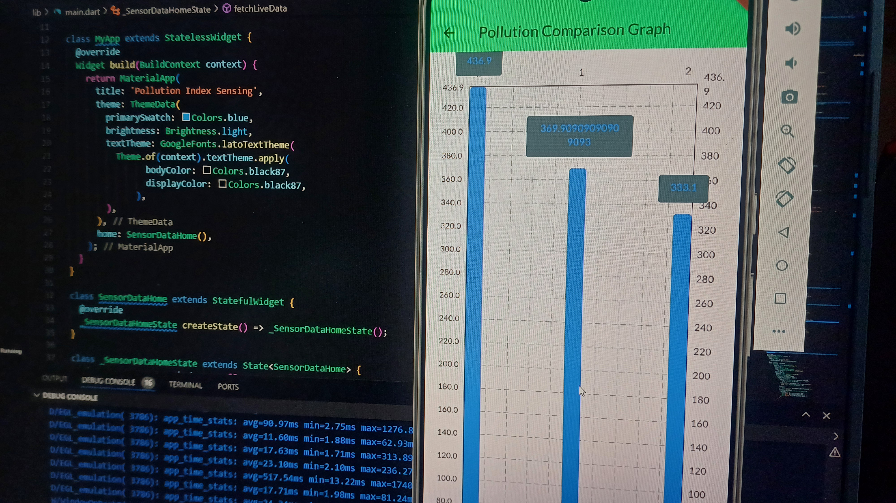
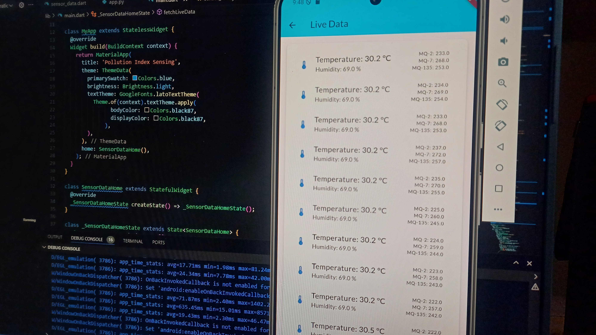
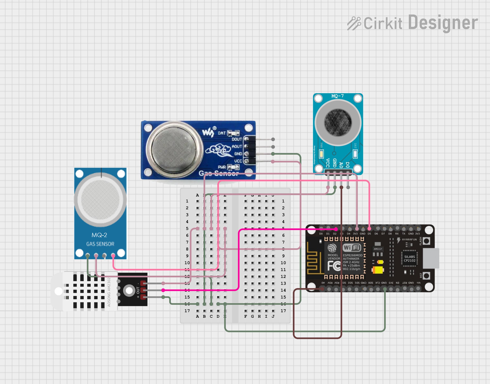

# Pollution Monitoring System using MQ-135 Sensor and IoT

<p align="right">Author: Yash Sharma</p>

## Table of Contents
1. [Project Overview](#project-overview)
2. [Features](#features)
3. [Components and Materials](#components-and-materials)
4. [Circuit Connections](#circuit-connections)
5. [Software Requirements](#software-requirements)
6. [Setup and Installation](#setup-and-installation)
7. [Code Explanation](#code-explanation)
8. [Running the Project](#running-the-project)
9. [App Integration](#app-integration)
10. [File Structure](#file-structure)
11. [License](#license)

---

## Project Overview

This project monitors the pollution levels in a specific area using the MQ-135 gas sensor and sends the data to an IoT app. The app displays real-time pollution indices, providing users with an easy way to track air quality. The pollution data is gathered using an Arduino board and communicated via Wi-Fi using the ESP8266 module.

---

## Features

- **Real-time Pollution Monitoring**: Continuous tracking of air quality using the MQ-135 sensor.
- **IoT Integration**: Sends pollution data to a mobile or web app for easy visualization.
- **User Notifications**: Alerts when pollution levels exceed a threshold.
- **Simple Setup**: Easy-to-follow wiring and coding setup.

---

## Interface

Below is the interface for app:




---

## Components and Materials

- **MQ-135 Gas Sensor**
- **Arduino UNO**
- **ESP8266 Wi-Fi Module**
- **Breadboard**
- **Jumper Wires**
- **USB Cable for Arduino**
- **Resistors (10k ohm)**
- **Power Supply (5V)**

---

## Circuit Connections

Follow these connections to set up the hardware:

### MQ-135 Sensor to Arduino:

| MQ-135 Pin | Arduino Pin |
|------------|-------------|
| VCC        | 5V          |
| GND        | GND         |
| AO         | A0          |

### ESP8266 to Arduino:

| ESP8266 Pin | Arduino Pin |
|-------------|-------------|
| VCC         | 3.3V        |
| GND         | GND         |
| TX          | RX (via 1k resistor) |
| RX          | TX (via 1k resistor) |
| CH_PD       | 3.3V        |

> **Note**: Use a voltage divider (with 1k resistors) for the ESP8266's RX pin to protect it from 5V logic.



---

## Software Requirements

- **Arduino IDE** (for programming the Arduino)
- **Libraries**:
  - WiFiEsp (for ESP8266 communication)
  - MQ135 (for sensor readings)
- **IoT App** (Flutter-based mobile app or any preferred IoT platform)

---

## Setup and Installation

### 1. Install Libraries

Install the following libraries via the Arduino IDE:

1. Go to **Sketch > Include Library > Manage Libraries**.
2. Search for and install:
   - WiFiEsp
   - MQ135

### 2. Configure the Code

Update the following variables in the code:

```cpp
const char* ssid = "YOUR_WIFI_SSID";
const char* password = "YOUR_WIFI_PASSWORD";
const char* server = "YOUR_SERVER_URL";

---

## File Structure
Here is the directory structure for this project:

graphql
Copy code
cnproj_app/
├── assets/                # Contains images (e.g., circuit diagram)
│   └── circuit_diagram.png
├── src/                   # Source code for Arduino
│   └── main.ino
├── README.md              # Project documentation
├── app/                   # IoT app code (e.g., Flutter app)
│   └── lib/
├── .gitignore             # Git ignore file
└── LICENSE                # Project license file
---

## License
This project is licensed under the MIT License. Feel free to use and modify it.
---